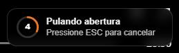
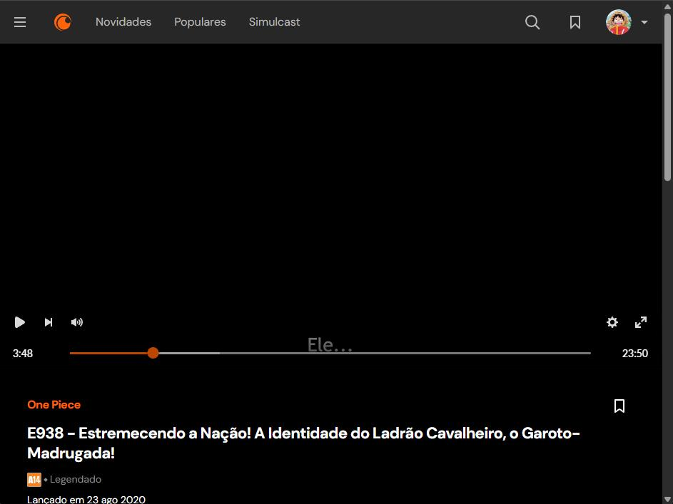
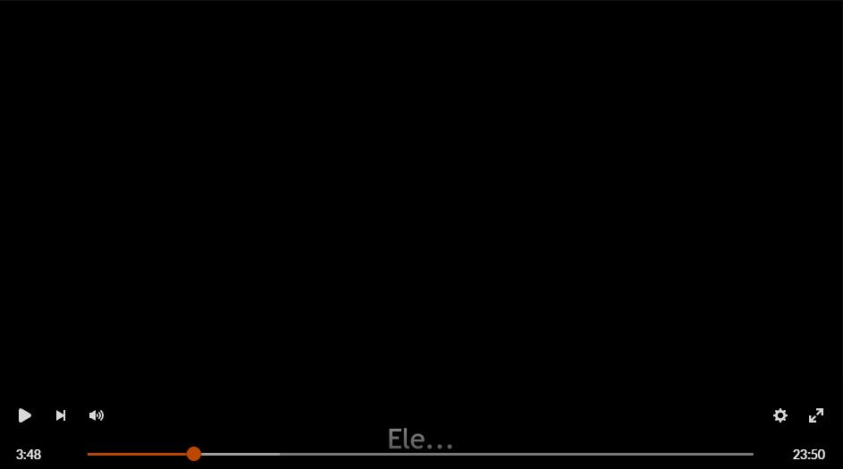
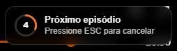

# Crunchyroll — Player Plus

Um script para **melhorar o player da Crunchyroll no navegador**, focado em maratona: **pular abertura automático**, **modo teatro (widescreen) sem distrações**, **próximo episódio automático por anime** e **Picture-in-Picture (PiP)** — tudo configurável **dentro do próprio player**, sem mexer em código.

> Este projeto não é afiliado à Crunchyroll.

## ✅ Requisitos

- Extensão **Tampermonkey**, **Greasemonkey** ou **Violentmonkey** instalada no navegador (Chrome/Edge/Brave/Firefox).

---

## 📦 Instalação

### Instale pelo link abaixo (recomendado)
Ao abrir esse link, o Tampermonkey reconhece automaticamente e mostra a tela de instalação.

👉 **[Instalar / Atualizar](https://raw.githubusercontent.com/leorcdias/crunchyroll-player-plus/main/dist/crunchyroll-player-plus.user.js)**

---

## 🚀 Funcionalidades

### 1) Pular abertura automática
- Pula a abertura automaticamente após **5 segundos**
- Para cancelar o pulo, pressione **ESC**

---

### 2) Modo teatro
Em **Configurações > Modo vídeo**, ativa a exibição “limpa”:
- Mostra **somente o vídeo**, sem elementos extras da página
- Ideal pra assistir enquanto está com outras janelas abertas

Use a **tecla de atalho B** para alternar entre **Modo Teatro** e **Exibição Padrão**

**Antes:**  

**Depois:**  

---

### 3) Próximo episódio automático
Em **Configurações > Próximo episódio**, você define **quantos segundos antes do fim do episódio** deve avançar automaticamente para o próximo.

- Essa configuração funciona **por anime**. Cada anime salva seu próprio tempo
- Se estiver em **0s**, ele não avança automaticamente

#### Exemplo:
- O episódio possui **23m50s**
- Você define a configuração em **40s**
- Ao chegar em **23m10s** irá automaticamente para o próximo episódio

#### Como definir o tempo de maneira fácil:
Quando aparecer a tela final do episódio atual, simplesmente aperte a **tecla N**. Dessa forma, será definido automaticamente o tempo ideal para pular para o próximo episódio.

> Essa configuração precisa ser feita apenas *1 vez por anime* e funciona melhor em animes onde o tempo total após o final do episódio é sempre o mesmo

---

### 4) Picture-in-Picture (PiP)
Habilita o modo **PiP** no player da Crunchyroll.

> ⚠️ Observação: as legendas da Crunchyroll normalmente **não aparecem** no PiP (limitação comum de players/legendas).

---

## ⌨️ Atalhos

- **ESC** → Cancela o pulo automático da abertura e próximo episódio
- **B** → Alterna entre Modo Teatro e Modo Padrão
- **N** → Define o tempo atual para “Próximo episódio” (por anime)

## 🐞 Problemas / sugestões

Se algo quebrar (a Crunchyroll muda a UI com frequência), [abra uma issue aqui](https://github.com/leorcdias/crunchyroll-player-plus/issues).

Informe, se possível:
- Navegador + versão
- Versão do script
- Print ou vídeo curto do problema
- Link do episódio/anime

---

## ⚠️ Aviso

Este projeto **não é afiliado** à Crunchyroll.  
Ele apenas ajusta o comportamento do player no seu navegador via extensão no navegador.
